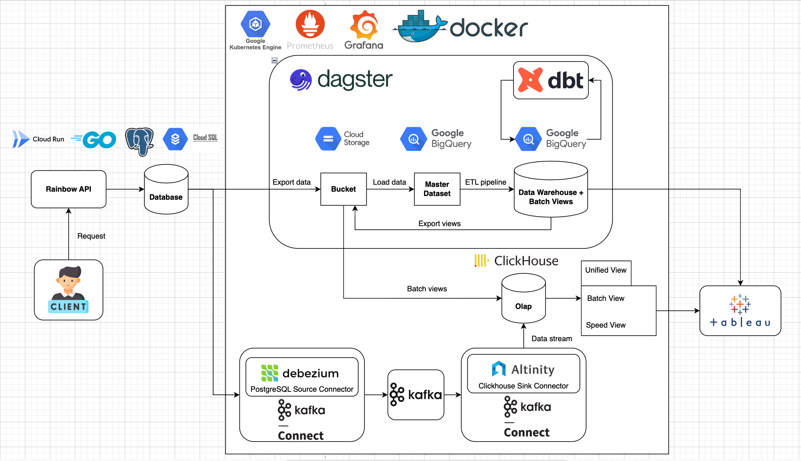
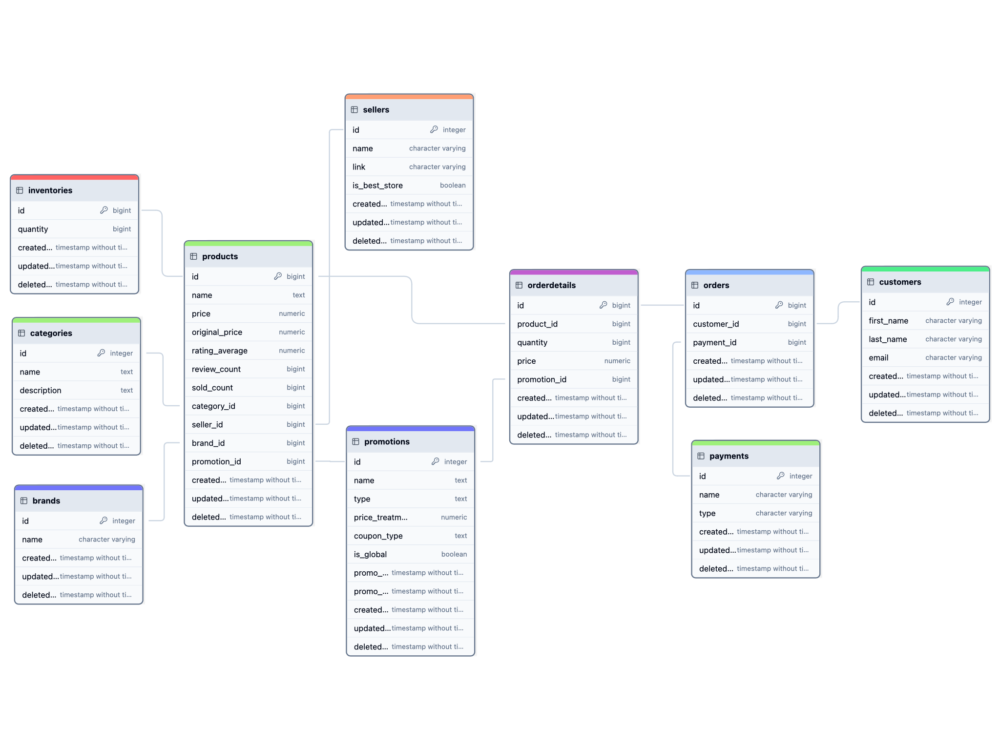
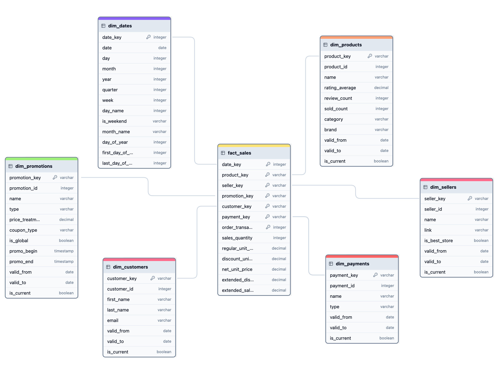

# Rainbow Project

## Summary

- By taking on the task of building a Data Engineering project from scratch, I have the opportunity to get exposure to and hands-on experience with the various languages, frameworks, patterns, and tools that a Data Engineer utilizes throughout the product development lifecycle.
- I have migrated my project from local development to Google Cloud Platform. This progress took me about approximately 4 weeks to complete. Although there are still some unreasonable points, but I always tried my best and put all my effort in this project to develop, maintain and improve the project.

### Architecture



### Services

1. **Rainbow API**
    - API base url: [https://rainbow.tuantrann.work](https://rainbow.tuantrann.work/)
2. **Dagster Webserver**
    - Webserver url: [https://dagster.tuantrann.work](https://dagster.tuantrann.work/)
3. **Kafka UI**
    - Kafka UI url: [https://kafka-ui.tuantrann.work](https://kafka-ui.tuantrann.work/)

# Components

## Rainbow API

- This Rainbow API is mainly built for generating order data in this project using Golang.

### Routes

1. **Base Routes**

    **`GET /ping`**

    - **Description**: Health check endpoint.
    - **Response**:
        - **200 OK**: The service is running.

    ---

    **`GET /`**

    - **Description**: Information about the service.
    - **Response**:
        - **200 OK**: Service information.

    ---

2. **Order Routes**

    **`GET /api/v1/orders/:id`**

    - **Description**: Retrieve an order by its ID.
    - **Parameters**:
        - `id`: The ID of the order.
    - **Response**:
        - **200 OK**: Returns the order details.
        - **404 Not Found**: Order not found.

    ---

    **`GET /api/v1/orders`**

    - **Description**: Retrieve a list of all orders.
    - **Response**:
        - **200 OK**: Returns a list of orders.

    ---

    **`POST /api/v1/orders`**

    - **Description**: Create a new order.
    - **Request Body**:
        - `customerId`: The ID of the customer placing the order.
        - `payment_id`: The ID of the payment method used.
        - `products`: List of products in the order, each containing:
            - `productId` (int): The ID of the product.
            - `quantity` (int): The quantity of the product.
    - **Response**:
        - **201 Created**: Order created successfully.
        - **400 Bad Request**: Invalid request body.
        - **500 Internal Server**: Server Error.

### API Request Flow

- Some definitions when working with API:
  - **Routes**: Defines the endpoints of your API and maps HTTP requests to corresponding controller actions.
  - **Controllers**: Controllers handles HTTP requests, extracts necessary data, and calls appropriate service methods.
  - **Services**: Services contain the business logic of your application. It performs operations, calls the repository for data access, and processes data before returning it to the controller.
  - **Repositories**: Repositories are responsible for data access. It performs CRUD operations on the database.
  - **Unit of Work**: Unit of Work is a design pattern that helps to maintain consistency and integrity in the database. It keeps track of all the changes made to the database and commits them as a single transaction.
  - **Models**: Models are the data structures that represent the data in your application. It contains the schema of the database tables.
- The flow when a request being sent to the endpoint:

    ```
    **Request → Router → Controller → Service → Repository → Model / Entity & Database**
    ```

## Database

- PostgreSQL relational database is used as our database in this project. Below is the schema of the database.

    

## Data Warehouse

- The amount of data generated is constantly increasing day by day and we need to find new ways of utilizing the vast amounts of that are stored in source systems. Data Warehouse is a central repository that stores organization's data with the goal of supporting business intelligence and data analytics.
  - **4 Steps Dimensional Design Process ?**
    - **Step 1:** Select the business process.
    - **Step 2:** Declare the grain.
    - **Step 3:** Identity the facts.
    - **Step 4:** Identity the dimensions.
- Our target is to perform sales analytics with our transactional data, we construct the data warehouse which centralized the sales data with additional relevant data. I am using Google BigQuery as my data warehouse for this project.

    

### **Data Source (Master Dataset)**

- This is where the raw data originates which we define it as our **Master Dataset**. This source provides that the transactional data with relevant data in the database will be processed and stored in the data warehouse.

### **Staging Area**

- Data from the sources is first loaded into a staging area. The schema in the staging layer is the same as the schema in the Master Dataset.
- This staging area is used to reduce the operations and load times on the source systems.

### **Data Warehouse Layer**

- Our target is to perform sales analytics with our transactional data, we categorize the data into star schema in data warehouse.

    

- The star schema involves those components:
    1. **Fact table**:
        - A fact table contains the quantitative data (facts) of a business process or event also foreign keys that reference primary keys in dimension tables.
        - Granularity: Each row in a fact table is a record of an item sold.
        - This fact table `fact_sales` captures the quantitative data related to sales transactions. Our quantitative data or facts are sales data contain quantity of products sold (`sales_quantity`), unit and extended total amount (`regular_unit_price`, `net_unit_price`, `extended_sales_amount`), discount amount (`discount_unit_price`, `extended_discount_amount`).
    2. **Dimension table**:
        - Dimension tables store descriptive information or attributes related to the business process or event recorded in the fact table.
        - Dimension tables: `dim_dates`, `dim_customers`, `dim_products`, `dim_sellers`, `dim_promotions`, `dim_payments`.
        - **Slowly Changing Dimensions (SCDs) in Data Warehouses**
            - Slowly Changing Dimensions in Data Warehouse is an important concept that is used to enable the historic aspect of data in an analytical system.
            - In this project, I implement the SCD type 2 where a change occurs in a dimension record results in a new row added to the table to capture the new data, and the old record remains unchanged and also is marked as expired.
            - For SCD Type 2, I need to include three more attributes `valid_from`, `valid_to` and `is_current` as shown below. The newest version of record will have the column `valid_to`'s value `2100-01-01` and also the column `is_current`'s value `true`.

                

### Access Layer

- With data stored in data warehouse, we can connect to visualization tools or applications for building charts, dashboards.

## Lambda Architecture

- Lambda Architecture is a data processing architecture that takes advantages of both batch and streaming processing methods.

    

### Batch Layer

- Batch layer is responsible for 2 purposes: **Handling the historical data** and **Generating batch views** of precomputed results.

    

- It manages the master dataset where the data is immutable and append-only, preserving a trusted historical records of all the incoming data from source. I created a dataset `raw` for storing master dataset.

    

- Batch views are precomputed using BigQuery with SQL scripts. They are stored in a dataset `warehouse` and exported into flat files where OLAP Database (Clickhouse) can ingest from this.

    

### Speed Layer

- By design, the batch layer has a high latency, typically delivering batch views to the serving layer at a rate of once or twice per day. Speed layer handles realtime data streams and provides up-to-date views.

    

- In this project, the stream flows are just to deliver data from source (**Rainbow Database**) to our sink (**OLAP Database**) in near realtime without processing. Data after being transmitted to the destination will be aggregated and formed speed views.
- I am using Kafka Connect to establish data streams from the source to sink by configuring two plugins **`io.debezium.connector.postgresql.PostgresConnector`** and **`com.clickhouse.kafka.connect.ClickHouseSinkConnector`**.

### Serving Layer

- The data serving layer receives the batch views from the batch layer and also receives the near real-time views streaming in from the speed layer.
- Serving layer merges results from those two layer into final unified views.

    

## Data Pipeline

- Our data pipeline mainly focus on moving, transforming and organizing data to serve the need of Batch layer in the lambda architecture.
- For orchestrating, scheduling the pipeline in an automatically way, I am using open source tool called [**Dagster**](https://dagster.io/). Moreover, [**dbt**](https://www.getdbt.com/) is used for transformation steps in our data pipeline.

    

### Dagster

- Dagster models pipelines in terms of the data assets. With Dagster, you declare functions in Python that you want to run and the data assets that those functions produce or update.

1. **Assets**
    - Dagster is asset-centric, which declare that the primary focus is on the ***data products* (assets)** generated by the pipeline. An **asset** is an object in persistent storage, such as a table, file. In this project, I defined many assets, each asset is responsible for a result of one step.

        

    - For example, the asset **`gcs_orders_file`** is responsible for extracting data of table `orders` from Rainbow Database and saving as a parquet file in Google Cloud Storage. Or the asset **`fact_sales`** is the fact table in our data warehouse, it is created by aggregating and transforming data from staging and dimension tables.

        

    - Dagster automatically tracks asset dependencies and it allows you to track the current state of your assets. Assume if upstream assets are materialized but the downstream assets, it will mark the state of downstream assets as `Out of sync`.
    - Dagster provides **[Asset Checks](https://docs.dagster.io/concepts/assets/asset-checks#asset-checks)** to define and execute different types of checks on your [data assets](https://docs.dagster.io/concepts/assets/software-defined-assets) directly in Dagster. This help us to perform some kind of data quality tests or data existing checks.

        

    - Dagster also allow us to provide rich metadata for each assets.

        

2. **Partitions & Backfill**
    - An asset definition can represent a collection of **partitions** that can be tracked and materialized independently. In other words, you can think each partition functions like its own mini-asset, but they all share a common materialization function and dependencies.
    - For example, I have a `DailyPartition` asset where each partition key represent a date like `2024-09-01`, `2024-02-09`, …

        

    - Using partitions provides the following benefits:
        - **Cost efficiency**: Run only the data that’s needed on specific partitions.
        - **Speed up compute**: Divide large datasets into smaller, allow boosting computational speed with parallel processing.
    - **Backfilling** is the process of running partitions for assets or updating existing records. Dagster supports backfills for each partition or a subset of partitions. Backfills are common when setting up a pipeline where:
        - Run the pipeline for the first time where you might want to backfill all historical and current data.
        - Scenario when you changed the logic for an asset and need to update historical data with the new logic.
    - In the project, this backfill job will materialize on all **`37`** partitions.

        

3. **Resources**
    - In data engineering, resources are the external services, tools, and storage you use to do your job.
    - In this project, the pipeline often interacts with Rainbow Database, Google Cloud Storage, BigQuery. A `gcs` resource is described as below.

        

    - The concept of **resource** is similar to the concept of **connection** in Airflow. I observe that the two biggest advantages of the resource in Dagster are the reusability in code and resource dependency in asset.
4. **Assets Job**
    - [Jobs](https://docs.dagster.io/concepts/ops-jobs-graphs/jobs) are the main unit for executing and monitoring asset definitions in Dagster. An asset job is a type of job that targets a selection of assets and can be launched.
    - In this project, I define an asset job called `batch_job` with the purpose of running the whole pipeline in batch layer. This job is launched at fixed interval, by using **schedules**.

        

5. **Schedules**
    - Schedules are Dagster's way of supporting traditional methods of [automation](https://docs.dagster.io/concepts/automation), which allow you to specify when a [job](https://docs.dagster.io/concepts/ops-jobs-graphs/jobs) should run. Using schedules in this project, the whole pipeline is set up to run at a fixed time at **0:00 AM UTC** every day.

        

    - In this project, partitioned assets will be run on the latest partition key. In other words, if I have `DailyPartition` asset, each day the pipeline will run on the partition key of the previous date. For example, if the current date is `2024-09-02`, then the pipeline will be provided a partition key of the previous date `2024-09-01` when it starts to run.

### **Dbt**

- Our project consists of ETL pipeline where we extract data from Rainbow Database, transform and load them to the Data Warehouse. The letters **E** and **L** are the process of moving data between two places in which we can easily achieve this by writing script and defining them as assets in Dagster.
- The remaining letter **T** represents for the transformation step. To achieve this step, I decide to transform using SQL script and [dbt](https://docs.getdbt.com/docs/introduction) is the most suitable to this situation.
- Dbt is **a data transformation tool** that enables data analysts and engineers to transform data in a cloud analytics warehouse.

1. **Model**
    - Dbt model is essentially a SQL file that contains a transformation query. This query decides how data is transformed from its raw form to a usable form in the data warehouse.
    - The SQL query is saved as a view or table in the data warehouse. This means that we don’t need to care about scripts to create a view or a table and instead focus on the transformation logic only.
    - For example, I have a dbt model `dim_products` which represents the transformation logic of creating a dimension table for product data. Every time this dbt model runs, the new data is inserted incrementally to the table `dim_products` in our data warehouse by specifying `materialized='incremental'`.

        ```sql
        {{
            config(
                materialized='incremental',
                unique_key='customer_key',
                incremental_strategy='merge'
            )
        }}
        
        WITH latest_version AS (
            SELECT
                id,
                first_name,
                last_name,
                email,
                updated_at,
                ROW_NUMBER() OVER (PARTITION BY id ORDER BY updated_at DESC) AS row_num
            FROM {{ ref('stg_customers') }}
        ),
        current_customers AS (
            SELECT
                id,
                first_name,
                last_name,
                email,
                updated_at
            FROM latest_version
            WHERE row_num = 1
        ),
        existing_customers AS (
            SELECT
                dc.customer_key,
                dc.customer_id,
                dc.first_name,
                dc.last_name,
                dc.email,
                dc.valid_from,
                EXTRACT(DATE FROM cc.updated_at) AS valid_to,
                FALSE AS is_current
            FROM {{ this }} AS dc
            JOIN current_customers AS cc ON dc.customer_id = cc.id
            WHERE dc.is_current = TRUE
            AND (
                dc.first_name != cc.first_name OR
                dc.last_name != cc.last_name OR
                dc.email != cc.email
            )
        ),
        new_customers AS (
            SELECT
                {{ dbt_utils.generate_surrogate_key(['id']) }} AS customer_key,
                cc.id AS customer_id,
                cc.first_name,
                cc.last_name,
                cc.email,
                EXTRACT(DATE FROM cc.updated_at) AS valid_from,
                DATE '2100-01-01' AS valid_to,
                TRUE AS is_current
            FROM current_customers AS cc
            LEFT JOIN {{ this }} AS dc ON cc.id = dc.customer_id
            WHERE dc.customer_id IS NULL OR dc.is_current = FALSE
        )
        SELECT * FROM existing_customers
        UNION ALL
        SELECT * FROM new_customers
        ```

2. **Test**
    - Data tests are assertions you make about your models and other resources in your dbt project. This improve the integrity of the SQL in each model by making assertions about the results generated.
    - Data tests are SQL queries. In particular, they are `select` statements that seek to grab "failing" records, ones that disprove your assertion.
    - For example, I have a dbt test `assert_consistent_total_sales.sql` in which I want to ensure that the total sales value after transforming and loading to data warehouse is consistent to the total sales value in the raw form. This test will fail in case this query returns the count differ than 0.

        ```sql
        WITH revenue_fact_sales AS (
            SELECT
                SUM(extended_sales_amount) AS total_extended_sales_amount
            FROM {{ ref('fact_sales') }}
        ),
        revenue_raw_order_details AS (
            SELECT
                SUM(quantity * price) AS total_extended_sales_amount
            FROM {{ source('rainbow', 'orderdetails') }}
        )
        SELECT
            COUNT(*)
        FROM revenue_fact_sales
        JOIN revenue_raw_order_details
            ON revenue_fact_sales.total_extended_sales_amount != revenue_raw_order_details.total_extended_sales_amount
        ```

### **Dagster & dbt**

- You can think of dbt model as an asset in Dagster. When a dbt model runs, it can create a view or table in our data warehouse which we can call it as a Dagster asset. The dependencies between dbt models are also dependencies of corresponding assets in Dagster.

    

- Dagster can orchestrates, schedules the run of those dbt models. Dagster makes use of dbt tests as asset checks, therefore, it ensure the data quality when integrating them together.

    

## Kafka

### Architecture

- In this project, I create a single Apache Kafka cluster with `3` brokers. Each topic within this cluster have `3` partitions and `2` replicas. The amount of data is not large, so that this setup is appropriate for serving the need of near realtime streaming.

    

  - **Message** is the Kafka’s unit of data like a row or a record of data. **Producer** publish messages into Kafka cluster. **Consumer** then consume those messages by pulling them from the system.
  - The published messages are stored in a server called **broker**. The broker receives messages from producers, assigns offsets, and writes them on disk. It also serves consumers by responding to the message fetch requests.
  - Messages are organized into **topics**. Each topic is divided into one or many **partitions**. A partition of a topic can be replicated to different brokers, so this means a topic can be scaled horizontally across multiple servers.

### Broker

- Single Kafka cluster is deployed into Kubernetes environment. Each broker lives within one separate Kubernetes pod.

    

### Topic

- Messages are organized into topics. For each table in Rainbow Database, it has a corresponding topic. E.g: Kafka will create a topic `products` for capturing data changes from table `products`.


- **Debezium** acts as the Kafka producer which it capture changes (inserts, updates, deletes) from our Rainbow Database. After capturing these changes, Debezium publishes them as events to Kafka topics.
- The **Clickhouse Sink Connector** serves as the Kafka consumer which it subscribes to the relevant topics and then writes the consumed data into the appropriate tables in ClickHouse.

    

## OLAP

- The serving layer of the Lambda Architecture is meant to provide near real-time analytics.
- Clickhouse is used as an OLAP Database in the Serving layer. ClickHouse uses a columnar database model, which enables fast query execution, so it fits the requirements of  due to the main purpose of Serving layer
