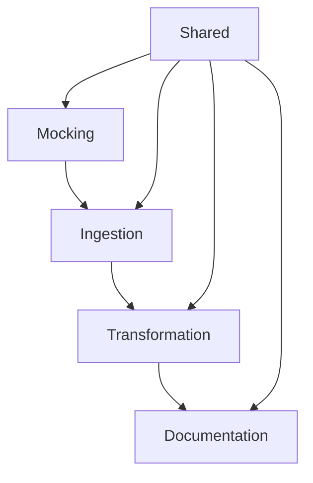

# Rainbow Dagster Workspace

This Dagster workspace is organized by **conceptual domains** following the [official Dagster documentation guidelines](https://docs.dagster.io/guides/build/projects/structuring-your-dagster-project#option-2-structured-by-concept).

## 🏗️ Architecture Overview

The workspace is structured around five main conceptual domains, each encapsulating related assets, jobs, schedules, and resources:

```
dagster_workspace/
├── ingestion/          # Data ingestion pipelines
├── transformation/     # Data transformation and modeling
├── mocking/           # Test data generation and API simulation
├── documentation/     # Documentation generation and publishing
├── shared/           # Common utilities and resources
└── definitions.py    # Main definitions file
```

## 📂 Domain Breakdown

### 🎯 **Ingestion Domain** (`ingestion/`)

**Purpose**: Extract and load data from external sources

**Components**:

- **`crawler.py`** - Web scraping from Tiki marketplace (books, authors, sellers)
- **`factory.py`** - DLT-based data extraction and loading pipelines
- **`crawling_jobs.py`** - Jobs for crawling operations
- **`crawling_schedules.py`** - Scheduled crawling (hourly)
- **`definitions.py`** - Ingestion domain definitions

**Assets**: `tiki_resources`, DLT pipeline assets
**Jobs**: `tiki_crawling_job`, DLT jobs
**Schedules**: `tiki_crawling_schedule` (hourly), DLT schedules

### 🔄 **Transformation Domain** (`transformation/`)

**Purpose**: Process and model data using dbt

**Components**:

- **`dbt_project.py`** - dbt project initialization and asset creation
- **`translators.py`** - Custom Dagster-dbt translators for asset naming
- **`dbt/`** - dbt models, macros, and configurations
- **`definitions.py`** - Transformation domain definitions

**Assets**: `dbt_models` (all dbt models)
**Jobs**: `dbt_materialization_job`
**Schedules**: Daily dbt model materialization

### 🧪 **Mocking Domain** (`mocking/`)

**Purpose**: Generate realistic test data for the Vietnamese book marketplace

**Components**:

- **`users.py`** - User registration with Vietnamese names and phone numbers
- **`transactions.py`** - Order creation with realistic purchasing patterns
- **`promotions.py`** - Promotion generation (flash sales, seasonal offers)
- **`mocking_jobs.py`** - Jobs for each mocking operation
- **`mocking_schedules.py`** - Automated test data generation schedules
- **`definitions.py`** - Mocking domain definitions

**Assets**: `user_registrations`, `order_transactions`, `promotion_creations`
**Jobs**: `users_mocking_job`, `orders_mocking_job`, `promotions_mocking_job`
**Schedules**:

- Users: Hourly
- Orders: Every 5 minutes
- Promotions: Twice daily

### 📚 **Documentation Domain** (`documentation/`)

**Purpose**: Generate and publish documentation

**Components**:

- **`docs_generation.py`** - dbt documentation generation and GCS upload
- **`docs_jobs.py`** - Documentation generation jobs
- **`docs_schedules.py`** - Automated documentation publishing
- **`definitions.py`** - Documentation domain definitions

**Assets**: `dbt_docs_generation`
**Jobs**: `dbt_docs_generation_job`
**Schedules**: `dbt_docs_daily_schedule` (2 AM daily)
**Sensors**: `dbt_docs_sensor` (triggers when dbt models are materialized)

### 🔧 **Shared Domain** (`shared/`)

**Purpose**: Common utilities and resources used across domains

**Components**:

- **`constants.py`** - Configuration constants and environment variables
- **`helpers.py`** - HTTP utilities, authentication, validation, DLT helpers
- **`exceptions.py`** - Custom exception classes
- **`resources/`** - Database connections and other shared resources
- **`configs/`** - DLT and other configuration files

## 🚀 Getting Started

### Loading the Workspace

```python
from definitions import main_defs

# The main_defs contains all domain definitions merged together
print(f"Total assets: {len(main_defs.assets)}")
print(f"Total jobs: {len(main_defs.jobs)}")
print(f"Total schedules: {len(main_defs.schedules)}")
```

### Working with Individual Domains

```python
# Load specific domain definitions
from ingestion.definitions import ingestion_definitions
from mocking.definitions import mocking_definitions
from transformation.definitions import transformation_definitions
from documentation.definitions import documentation_definitions
```

## 🔗 Domain Dependencies



- **Shared** → All domains (provides utilities and resources)
- **Ingestion** → **Transformation** (raw data flows to dbt models)
- **Transformation** → **Documentation** (dbt models trigger docs generation)
- **Mocking** → **Ingestion** (test data flows into ingestion pipelines)

## 📊 Monitoring & Operations

### Asset Groups

- `crawling` - Web crawling operations
- `mocking` - Test data generation
- `dbt_models` - Data transformation models
- `dbt_docs` - Documentation generation

### Schedule Overview

| Schedule | Frequency | Purpose |
|----------|-----------|---------|
| `tiki_crawling_schedule` | Hourly | Crawl marketplace data |
| `users_mocking_schedule` | Hourly | Generate test users |
| `orders_mocking_schedule` | Every 5 min | Generate test orders |
| `promotions_mocking_schedule` | Twice daily | Generate promotions |
| `dbt_materialization_job` | Daily | Transform data models |
| `dbt_docs_daily_schedule` | Daily 2 AM | Update documentation |

### Sensor Overview

| Sensor | Trigger | Purpose |
|--------|---------|---------|
| `dbt_docs_sensor` | When dbt models materialize | Generate fresh docs automatically |

## 🎯 Benefits of This Structure

### **Modularity**

Each domain is self-contained with its own assets, jobs, schedules, and resources.

### **Maintainability**

Easy to locate and modify related functionality within each conceptual area.

### **Scalability**

New team members can quickly understand and contribute to specific domains.

### **Developer Experience**

Clear separation of concerns makes the codebase more navigable and testable.

### **Production Ready**

Each domain can be deployed, monitored, and scaled independently.

## 🔧 Configuration

Key environment variables are centralized in `shared/constants.py`:

- **API Configuration**: `API_BASE_URL`, authentication credentials
- **Database**: Connection details for PostgreSQL
- **Mocking Limits**: Request sizes, retry settings, rate limiting
- **dbt**: Project paths, target profiles
- **GCS**: Documentation bucket configuration

## 📝 Migration Notes

This structure was migrated from a technology-based organization (assets/, jobs/, schedules/) to a concept-based organization following Dagster best practices. All functionality remains intact while improving code organization and maintainability.
